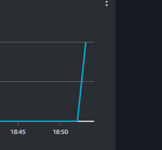

## 1. a)

For å få GitHub Actions workflow til å kjøre frå din GitHub-konto, må du:
 - Opprette IAM Access Key og Secret Access key ved å logge inn i AWS, gå til IAM -> Users -> Finn din bruker -> Security credentials -> Create access key. Disse nøklene må tas vare på, for videre bruk.
 - Etter opprettelse av IAM Access Key og Secret Access key, må du gå til https://github.com/<din-fork-av-dette-repoet> -> Settings -> Secrets and variables -> Actions -> Her må du lage 2 nye Repository secrets som du kaller for "AWS_ACCESS_KEY_ID" og "AWS_SECRET_ACCESS_KEY" og bruker den korresponderende verdien fra nøklene du lagde i forrige steg.
 - Til slutt må du gjøre ein push til både main-branch og til ein anna vilkårlig branch for å teste at den både bygger og deployer når man pusher til main, og at den berre bygger når du pusher til ein anna branch enn main.
 - Til slutt må du gjøre ein push til både main-branch og til ein anna vilkårlig branch for å teste at den både bygger og deployer når man pusher til main, og at den berre bygger når du pusher til ein anna branch enn main.
 
## 3. a)

Det står klart og tydelig i aws_apprunner_service dokumentasjon, at verdiene 256 for CPU og 1024 for Memory støttes
  
Men når eg programmatisk prøver å sette verdiene til å være lik det som er spesifisert i oppgaveteksten, får eg dette som svar:
  
  
Har forsøkt å sette som reine int-verdier (256/1024) samt string-verdier (0.25 CPU/1 GB), slik dokumentasjonen viser, men
den nekter la meg gjennomføre terraform plan til tross. Det som frustrerer meg, er at eg manuelt kan gå inn å endre verdiene
til ønska verdier i ettertid.

## 3. b)

Eg tar som utgangspunkt at du har gjort steget over, så å beskrive at du trenger egne IAM nøkkel-par tar eg for gitt at allerede er gjort.
Eg tar også som utgangspunkt at du har tenkt å bruke image i mitt ECR-repo.
Terraform state fil ligger i bucketen me har brukt gjennom faget, som spesifisert i oppgavetekst, så den trenger du heller ikkje tenke på.
Så i utgangspunktet trur eg du skal kunne gjøre push på main og ein vilkårlig branch for å teste, uten å måtte endre noko.

## 4. a)

Eg har valgt å lage 2 nye endepunkt som fungerer sammen, for å tillate bruker(e) å laste opp til min bucket. 
Dette primært for å gjøre det enkelt for bruker(e) å få verifisert om de bryter PPE-reglementet.
"/" - Ei simpel, visuell side der bruker kan velge ei lokal fil på disk for å laste opp til bucket.
"/upload" - Tar seg av sjølve opplastinga til S3-bucket.

### Metrics problemer

I skrivende stund, har eg ikkje fått til å implementere måleinstrumenter i applikasjonen min, og eg begynner å gå tom for tid
til å eksperimentere og få det til å fungere.
Eg får oppretta dashboard, og har forsøkt ørten forskjellige måter å få micrometer til å registrere dataen eg ønsker, men til
ingen hell. I oppgavetektsten står det "..Du kan bruke samme S3 bucket som vi har brukt til det formålet i øvingene." under 
oppg. 3, der terraform state-fila blir lagra i ei bucket som er i regionen eu-north-1. Eg gjorde det i første omgang, og i 
min desperasjon etter å få metrics til å fungere, gjekk eg vekk frå denne løysinga og oppretta ny bucket i eu-west-1 i håp om at
dette potensielt kunne løyse problemet mitt. Dette medførte ei rekke forandringer eg måtte gjere, som igjen medførte at eg
måtte slette den apprunner-servicen eg hadde køyrande i første omgang. Eg har siden sletta app-runner ved 2 anledninger, så
app-runner logger er ikkje lengre tilgjengelig (kanskje gjennom CloudTrail, men ikkje direkte applikasjonslogger frå ein 
kjørande app-runner instans). 

Eg forsøkte også å kopiere alt av nødvendig kode i "cloudwatch_alarms_terraform"-øvingen for å sjå om eg får det til å fungere
ved å bruke den istedet, for så å endre den fungerende koden steg for steg til å tilpasse denne eksamen, men fortsatt uten hell,
til tross for at når eg kjører ein curl til endepunktet, blir kallet mitt fullført. Eksempel på curl eg kjørte under:
```
curl --location --request POST 'https://esp3gbh2bp.eu-west-1.awsapprunner.com/account' \
--header 'Content-Type: application/json' \
--data-raw '{
    "id": 1,
    "balance" : "123123"
}'|jq
```
Eg kjem til å fjerne den koden eg har implementert frå "cloudwatch_alarms_terraform"-øvingen, til fordel for den koden eg har
laga for metrics ifbm. eksamen, slik at du kan sjå kva eg har gjort og korleis eg har tenkt. Dersom det er ønskelig, kan
øvings-koden leites opp på commit "Micrometer 1.6.1 Duplicate in pom.xml", sha: d1c2c33, og har jobba med den fram til og med 
commit "Separated dashboard to separate .tf file, and changed a few things", sha: 4e7cd02. 

Etter mykje feilsøking og forsøk på problemløysing, trur eg at eg har klart å finne root cause:
```
11-26-2023 03:15:54 AM 2023-11-26 02:15:54.059  INFO 1 --- [atlas-publish-0] c.n.s.ipc.http.HttpRequestBuilder        : attempt 1 of 3 failed: POST http://localhost:7101/api/v1/publish
11-26-2023 03:15:54 AM 2023-11-26 02:15:54.060  INFO 1 --- [atlas-publish-0] c.n.s.ipc.http.HttpRequestBuilder        : attempt 2 of 3 failed: POST http://localhost:7101/api/v1/publish
11-26-2023 03:15:54 AM 2023-11-26 02:15:54.060  WARN 1 --- [atlas-publish-0] c.netflix.spectator.atlas.AtlasRegistry  : failed to send metrics (uri=http://localhost:7101/api/v1/publish)
11-26-2023 03:15:54 AM java.net.ConnectException: Connection refused (Connection refused)
```
Først stusset eg veldig over localhost:7101, men eg får jo tross alt ein Connection refused. Så Atlas-serveren er jo oppe å
kjøre, men gir meg ikkje tilgang. Eg har forsøkt alt av løysinger eg kan tenke meg, og alt av forsøk Google har komt med
som har vært gjennomførbart for meg mtp prosjektsammenheng og oppbygning. På det her tidspunktet er eg tom for
tanker og idear, Google gjer meg ikkje fleire gode resultater og ChatGPT kjem med ganske ubrukelige forslag.
Siste ideen eg har igjen dukka opp seint i går kveld, og finner ikkje igjen link, men om eg forstod det riktig, måtte eg
opprette ein Firehose instans, samt ei til S3 bucket, for at eg først dumper metrikk-data i ein egen bucket, for så å bruke
Firehose til å sende metrikken til Cloudwatch. Dessverre fekk eg ikkje forsøkt denne framgangsmåten, då eg ikkje har riktige
permissions for Firehose.

Dersom du ser kva eg har gjort feil/mangler, hadde det vært av stor interesse om du kan legge ved ein liten forklaring i sensuren,
for eg er tom for ideer på nåværende tidspunkt, og veit ikkje kva eg skulle gjort annerledes. Ønsker å vite, slik at eg ved
neste anledning veit kva eg må gjere. På forhånd takk =)

# OPPDATERING 27/11 KL.19.58

Ved revertering tilbake til gamle koden, har noko uforklarlig skjedd. Plutselig får eg rapportert inn data til metrikkene mine
og eg forstår ikkje kva eg har gjort annerledes/kvifor det ikkje fungerte tidligere, men no plutselig har bestemt seg for å 
fungere. Eg skal prøve å bruke resten av kvelden på å implementere ønska funksjonalitet, men uvisst kor mykje eg klarer gjennomføre
med så begrensa tid. Hadde eg gjort dette i går, hadde eg forhåpentligvis hatt rikelig med tid til å fullføre.
  


### Metrics tankegang

Tanken var å opprette ein metric som holdt styr på totalt antall PPE-scans i regionen Face, for så å ha metrics som viser kor
mange som har ein Violation, slik at VerneVokterne har ein enkel og visuell statestikk over antall regelbrudd, og som viser
kor ofte det skjer regelbrudd.
Eg ville også lage ein metric som tar for seg alle regioner (Face, hands, head), for å påse at alle PPE-restriksjoner blir 
overholdt der det er viktig at alle forhåndsregler blir overholdt, f.eks. operasjonssal. 
Eg ønska også å lage ein metric for å finne ut av responstid frå ein bruker laster opp eit bilde, til det er analysert og
avgjort om det er violation eller ikkje. Dette kan være av viktighet, då ein kirurg i fullt sterilt utstyr ikkje burde eksistere
utenfor steril sone lengre enn nødvendig, og dersom prosesses med å bli analysert tar for lang tid, kan sterilitet bli komprimert.

## 4. b)

Då eg ikkje har fått til metrics, vil det også medføre at alarmer heller ikkje lar seg gjennomføre.

## 4. Drøfteoppgaver
### A - Kontinuerlig Integrering

Kontinuerlig Integrasjon (CI) handler om fortløypande og hyppige integrasjoner av ny funksjonalitet, forbedring av eksisterende 
kode, effektivisering, bugfiksing, feilsøking og å tilfredsstille kunder sine dynamiske ønsker/preferanser/behov.
Per definisjon, vil eg sei at kontinuerlig integrering er best beskrevet med akkurat de to ordene, og kan egentlig ikkje forklares
kortere eller bedre enn det. Med kontinuerlig, meinast ein viss grad for hyppighet, at noko skal skje jevnt og trutt, kanskje
regelmessig, men ikkje nødvendigvis på eit bestemt tidspunk, på ein bestemt dag, men i denne kontekst gjerne når det høver seg
og er potensielt gunstig. Integrasjon handler som nevnt over, å implementere/fasilitere for endringer/forbedringer av eit
eksisterande produkt.

De aller største fordelene med å bruke CI i eit utviklingsprosjekt er at det kan bidra til kontinuerlig forbedring. Man får
mulighet til å implementere små, inkrementelle endringer som kan være av stor betydning, på regelmessig basis. I dagens
samfunn, har man blitt vant med at alt av digitale platformer skal operere sømløst og på ein ikkje-merkbar tidsperiode.
Ved å ta i bruk CI, vil utviklere kunne imøtekomme både produkteigar sine ønsker, samt brukere sine ønsker om alt fra ny 
funksjonalitet, til forbedringer av nåværande system, til å fikse feil som måtte oppstå underveis. Samtidig kan det være
fordelaktig frå ein utvikler sitt ståsted, å kunne jobbe med forskjellige aspekter av applikasjonen/prosjektet kontinuerlig,
istedenfor å være låst til ein bit fra oppstart til avslutning. På den måte kan man også sikre seg at dersom ein sentral person
i prosjektet ikkje lenger er tilgjengelig, kan andre ta over og gjøre den jobben uten å måtte bruke lang tid på å integrere
ein ny person for den rollen. Samtidig vil det være til hjelp ifbm. effektivisering, då fleire auger ser bedre enn eit par, i 
den forstand at man kan "kode seg blind". Ved at fleire personer forstår samme kode, kan det være til hjelp, for ein anna person
kan hende ser ein måte å effektivisere ein funksjonalitet man sjølv enten har oversett, eller rett og slett ikkje veit kan bli 
skrevet på ein bedre måte. Ref. første gang eg såg måten å sette ein boolean verdi til være != seg sjølv. Før det tidspunktet,
lagde eg ekkelt lang metode for først å sjekke sin egen verdi, og dersom true skulle den bli false og vice versa. Man lærer
nye ting, heile tida, som igjen vil fungere som eit nytt verktøy til neste gang man skulle trenge det.

Reint praktisk, jobber med med CI i GitHub ved å ha ein workflow/pipeline, som sørger for sømløs integrering når visse parameter
er innfridd. Eksempelvis 
```
if: github.ref == 'refs/heads/main' && github.event_name == 'push'
```
gjør det mulig for eit utviklingsteam å jobbe på kvar sin branch med sine formål, og kan bygge og teste underveis uten at det
påvirker produksjonskoden. Når man er ferdig å teste, kan man pushe til main, og koden man har skrevet blir automatisk integrert 
for kundebasen. Dette gjør at ein utviklerteam på 4/5 personer, kan jobbe med 4/5 forskjellige nye funksjonaliteter, som alle
blir sluppet ut på markedet så fort de innfrir de krav som blir stilt. 

### B - Sammenligning av Scrum/Smidig og DevOps fra et Utviklers Perspektiv
#### 1. Scrum/Smidig Metodikk

Prinsippet bak Scrum, er at man er del av eit team (som igjen kan være ein del av team av teams), som sammen jobber om ein felles
målsetting som skal gjennomførest i løpet av ein gitt tidsperiode, også kalla ein Sprint (som forøvrig oftest varer mellom 
1-4 veker). Målsettinga brytes ned i fleire små komponenter som kan gjennomføres av enkeltindivider. Eit enkeltindivid tar 
på seg så mykje arbeid som hen trur er gjennomførbart i løpet av sprinten. Etter endt sprint, vil det man har gjort (forhåpentligvis)
bli levert til produkteigar i form av produksjonskode, så lenge det tilfredsstiller de krav som blir stilt. Scrum er ein iterativ 
prosess, der man har 4 hovedsteg som går igjen frå sprint til sprint, kort forklart;
- Planlegging/analysering -> Man analyserer det nåværande systemet/foreslåtte systemet, og legger ein plan for krav man kan innfri.
- Design -> Man designer først det overordnede ved systemet, og jobber oss nedover, gjerne ved hjelp av f.eks. diagrammer og tegninger.
- Utvikling -> Man følger design- og planleggingsfasen ved å utvikle komponentene man har satt seg som mål å fullføre.
- Evaluering -> Man evaluerer arbeidet som har blitt gjort, korleis man ligger an ifbm systemkravene framlagt og forbereder seg på neste sprint.

Fordelene med rammeverket til Scrum, er at det bidrar til samarbeid, da man jobber tett på kvarandre til einkvar tid, og det
skal være lett å rekke opp hånda og be om hjelp, da alle får sine muligheter til å ytre tanker, bekymringer, utfordringer og
gi komplimenter. Det kan også fungere bra som rammeverk, da man har gitte eventer man må forholde seg til, samt stor frihet
til å disponere og bruke tiden ellers etter eget ønske, og prioritere deretter. Faste rammer når det kommer til deadlines kan
også være fordelaktig, da det er lettere å jobbe inkrementelt med ein funksjonalitet, når ein veit når det forventes at skal 
leveres, istedenfor å "ta et skippertak". Samtidig er det ein gunstig måte å få implementert ny kode relativt fortløypande, 
samanlikna med den gamle fossefallsmodellen som var ein meir dominerande måte å håndtere implementasjon tidligere.

Ulempene med Scrum, kan være den begrensningen man har ifbm. deployment, at man må vente til sprinten er over før man får satt
det i drift. Ofte kan det være fordelaktig å få koden sin live så fort som mulig, for å kunne observere brukere for å kunne
videreutvikle/forbedre/tette hull. Effektiv tidsbruk er også eit anna aspekt som kan være ufordelaktig med Scrum. Som programmerer,
ønsker man gjerne å bruke tiden sin på å skrive kode, men mykje tid "forsvinner" pga alle gjøremålene rundt det å jobbe med
Scrum, spesielt i oppstarten av eit nytt prosjekt (ikkje for å ta vekk nytteverdien bak, som det så absolutt har). Det kan også
oppleves forstyrrende til tider, spesielt for de som er mest senior på prosjektet, da de ofte må bistå og hjelpe andre, istedenfor
å skrive kode. Det kan sjølvsagt sjåast på som ein positiv ting, i det lengre løp, da ein (forhåpentligvis) eleverer kunnskapen
til de som ikkje er like flinke, og hever det generelle kunnskapsnivået i gruppa.

#### 2. DevOps Metodikk

DevOps er bygd opp rundt 3 hovedprinsipper; Flyt, Feedback og Kontinuerlig Forbedring. 
Kombinert, legger desse 3 prinsippene til rette for at eit utviklingsmiljø kan levere god og sikker kode på ein effektiv måte,
regelmessig, hurtig og hyppig, samtidig som det bygger og forbedrer samarbeid på tvers av miljøet, da alle har ein finger 
med i spillet på alle plan. 
Meir utfyllande, tar desse hovedprinsippene seg av ulike sett av oppgaver, som sammen utgjør DevOps (Development & Operations):

##### Flyt

Flyt-delen av DevOps tar for seg sjølve arbeidsflyten gjennom software-utviklingens livssyklusen, og sørger for at det er ein
effektiv og sømløs prosess frå idéstadiet til idéen er ferdig integrert. Continuous Integration og Continuous Deployment (CI/CD)
er eit nøkkelbegrep her, der man tar i bruk f.eks. GitHub actions og skaper ein pipeline som automatiserer bygging, testing
og deployment, slik at utviklerteamet kontinuerlig kan levere endringer til produksjonskoden. Kode blir levert hurtig og hyppig 
til produksjon, ofte fordi man har tilrettelagt for slik automatisering, og oppfordres til små, inkrementelle endringer som 
igjen fasiliterer for regelmessig integrasjon og deployment. 

##### Feedback

Feedback-delen av DevOps fokuserer på å kvalitetssikre produktet gjennom heile livssyklusen, ved hjelp av prosesser som testing,
logging, metrikker, overvåkning, alarmer og tilbakemeldinger fra kunder/brukere/produkteigar.
Man tilrettelegger for å samle og analysere data, for så å gjøre endringer basert på behov og av optimaliseringsgrunnlag.

##### Kontinuerlig Forbedring

Ved å implementere og legge til rette alt det ovennevnte, sørger man for eit utviklingsmiljø der utviklere kan gjennom iterative
prosesser, implementere ny- og forbedret kode i små, inkrementelle steg, fortløypande og hurtig. Oppdager man eit problem, kan
det utarbeides ei løysing umiddelbart, og lansert ein fiks til problemet på veldig kort tid. Ønsker man å implementere ein ny
funksjonalitet, trengs den bare å utvikles og testes og sørge for at fungerer som ønskelig, for så å slippes til produksjon.
Slik kan eit DevOps-team utvikle og vedlikeholde systemer på ein effektiv og resultatsdrevet måte, og sørge for at kunder
og brukere til einkvar tid har eit velfungerende produkt, samt at problemer som måtte oppstå blir håndtert i samtid.

All things considered, er DevOps ein framgangsmåte å jobbe i eit utvikling- og operasjonelt arbeidsmiljø som er veldig
fram- og samtidsretta, samt potensielt essensielt for bedrifter å overleve i dagens høgteknologiske verden. Produktet som 
er i kontinuerlig utvikling, vil derav være av høg kvalitet, da problemer/nye behov blir tatt stilling til- og utviklet 
"à la minute".

Dei største utfordringane eg kan tenke meg som er knytta til DevOps, er først og fremst ein potensiell overgang frå non-DevOps- 
til ein DevOps tilnærming. Å gå frå f.eks. ein fossefall-metodikk til ein DevOps-metodikk kan være ein stor forandring som
er ukjent for de ansatte, og å endre totalt på korleis tilnærming man har til utvikling og leveranse kan medføre ein del
komplikasjoner. Eit anna aspekt som kan være problematisk, er dette med gamle systemer/språk/legacy-kode. Som nevnt i fleire
forelesninger, brukes fortsatt språk som t.d. COBOL som ein essensiell del i dagens systemer. Ein overgang til ein DevOps
tilnærming med slike språk, kan være ein utfordring i seg sjølv, spesielt sett i forbindelse med det faktum at det er begrensa
med tilgang på utviklere som kan språket. Det neste poenget eg vil dra fram er at det kan potensielt bli ein stor personlig
påkostning for (kanskje spesielt for Operasjons-delen) teamet. Operasjonell drift innebærer at nokon til ein kvar tid er
tilgjengelig for å sørge for at systemet er operasjonelt. Man kan sjølvsagt argumentere for at det er ein essensiell bit av
DevOps prinsippet, men det er ikkje til å underbygge at det kan oppleves som invaderende for privatlivet til individer. 
Derfor vil det være viktig at alle parter er inneforstått med det ansvaret som medfølger, og at hensyn blir tatt der det trengs.
Siste eg vil nevne her, er kun personlig synsing, og kan vel best oppsummerest med terminologien "trigger-happy". Eg ser for meg,
at i ein DevOps-tilnærming, kan enkelte individer fort bli litt for ambisiøs og oppleve eit "rush" ved å trykke på Deploy-knappen.
Dette kan igjen medføre at man ønsker levere oftere enn man burde, og ikkje sørger for at det man leverer lever opp til den
standarden resten av teamet forventer, som igjen kan by på nye utfordringer.

#### Sammenligning Scrum vs DevOps

Til tross for at Scrum og DevOps er to forskjellige metodikker som har forskjellig tilnærming til systemutvikling, deler dei
ein del egenskaper, men gjerne med egen tilnærming på korleis dei blir håndtert:
 - Begge tilnærmingane har ein iterativ tilnærming til levering, men forskjellige tidsaspekter dei opererer med. Scrum opererer med
Sprinter som vanligvis leverer kode i intervaller på 1-4 veker, mens DevOps fokuserer på kontinuerlige og hyppige leveringer etter behov.
 - Scrum er ofte bygd opp av teams med ulik bakgrunn/kunnskap som sammen jobber mot eit felles mål, mens DevOps-teams gjerne
har litt meir integrert team der det er meir fokus på samarbeid og kunnskapsøkning på tvers av teamet.
 - I DevOps er kontinuerlig forbedring eit veldig sentralt aspekt, der tilbakemeldinger, evalueringer og forbedringer blir
gjort fortløypande, mens i Scrum er dette typisk gjort som ein del av retrospektivet som utføres på slutten av ein sprint.
 - Levering basert på kunders behov er sentralt for begge metodikkene. I Scrum skjer dette typisk via User Stories som blir 
prioritert etter behov og levert deretter ifbm sprinter, mens for DevOps når eit behov oppstår, kan det håndteres umiddelbart
og leveres fortløypande.
 - Kommunikasjon og samarbeid er eit viktig aspekt for begge. I Scrum er det tilrettelagt via aktiviteter som t.d. daglige 
stand-up møter, sprint planlegging og retrospektiv. I DevOps gjøres dette meir dynamisk gjennom felles kommunikasjonskanaler,
fysisk tilstedeværelse, delte verktøy, post mortem, etc.
 - For begge metodikkene, er verdi og kvalitet særdeles viktig. Måten DevOps sørger for dette, er ved automatisering av testing,
overvåkning og tilbakemelding, og sørger for at kvalitet blir opprettholdt ved kvar leveranse. Scrum sørger for at kvalitet blir
ivaretatt ved å ha ein tilnærming der man kun leverer dersom det man har utviklet lever opp til den standard som er forventa.

Etter å ha dyppet føttene i begge framgangsmåtene å utvikle på, ser eg for meg at eg personlig hadde trivdes best med ein
DevOps-tilnærming, da det tilrettelegger for at eg kontinuerlig kan jobbe med de aspektene eg syns er kjekkest med programmering,
nemlig det å skrive kode og lage ny funksjonalitet og kontinuerlig forbedre eit eksisterende produkt.
Med tanke på når det kan være fordelaktig med den eine tilnærmingen over den andre, kan eg sjå for meg at i oppstartsfasen
av utvikling av eit nytt produkt, kan ein Scrum-tilnærming være gunstig, da man har klare målsettinger og prioriteringer, samt
at man har "dead-lines" man kan forholde seg til. Med eit etablert produkt, trur eg heller ein DevOps-tilnærming er fordelaktig,
både for kunder, bruker, produkteigar og utviklere, da det tilrettelegger og tilfredsstiller alle parter til ei kvar tid, 
spesielt mtp kontinuerlig forbedring og integrering. 
Sett på ein anna måte, vil DevOps være ein meir gunstig tilnærming når tid er av essens, altså dersom eit problem oppstår så
er det av høg viktighet at problemet blir retta opp i snarest mulig, samt i situasjoner der kunders behov endres regelmessig
og hensyn må bli tatt for å imøtekomme disse behov.
Avslutningsvis kan eg sjå for meg at ein tilnærming som implementerer det beste (evt. de aspektene man føler er mest relevant
i forhold til problemstillingen man står ovenfor) frå begge metodikkene kan være fordelaktig. Eksempelvis kan det innebære
at man bruker prosjektstrukturen til Scrum og dens tilnærmingen til planlegging og prioritering, mens man implementerer 
automatiseringsprosessen og pipelinen til DevOps for å kvalitetssikre produktet.

### C - Det Andre Prinsippet - Feedback

For å sikre at ein ny funksjonalitet møter brukernes behov ved implementasjon av ein ny funksjonalitet, ville eg først og fremst
utviklet enhetstester som sørger for at funksjonaliteten fungerer som tiltenkt, og eliminere muligheter for feil. Dette kan
også gjøres underveis med teknikker som TDD og BDD, og på den måten sikre seg underveis, eller at man ikkje glemmer enkelte 
aspekter dersom man skriver tester til slutt. Tilrettelegging for god loggføring kan gjøre livet vesentlig enklere når/dersom
feil skulle oppstå, og man må løyse problemet raskest mulig. Ved å ta i bruk metrikker, kan man overvåke systemet og den nye
funksjonaliteten, og på den måten forhåpentligvis fange opp potensielle problemer og fikse dei før dei blir kritiske.
Implementerer man alarmer for ulike metrikker, kan man definere terskelverdier og akseptabel/uakseptabel "oppførsel" av
funksjonaliteten, og gjøre endringer der det trengs, eksempelvis opp-/nedskalering etter behov.

Feedback bidrar til kontinuerlig forbedring gjennom heile utviklingslivssyklusen ved å danne eit oversiktlig innsyn i systemet
og arkitekturen ved hjelp av t.d. metrikker, som igjen er med på å identifisere problemer, utfordringer og potensielle flaskehalser.
Bryter man det ned, kan tilbakemelding frå kunder og brukere være til stor hjelp å definere krav til systemet frå oppstart.
Kvaliteten på koden i utviklingsfasen øker ved å ta i bruk verktøy som t.d. par-programmering, TDD og BDD, samt at man kan
evaluere koden til kvarandre, både for kvalitetssikring, men også for å øke kunnskap og forståelse på tvers av teamet.
Testing av systemet er også ein viktig og sentral del av det å kvalitetssikre produktet man leverer, og sørger for å
minimere/eliminere feil/mangler/bugs.
Automasjon knytta rundt pipeline sørger for at koden man leverer, lever opp til ein gitt og bestemt standard, som gjør at kontinuerlig 
integrering og levering skjer sømløst. Om det skulle feile i pipeline, har man automatisk verktøy tilgjengelig for å kunne
identifisere kor feilen ligger, som igjen gjør det (relativt) enkelt å fikse underveis.
Overvåkning av systemet gjennom metrikker gjer det mulig for Operasjons-delen av DevOps å holde systemet ved like.
Tilbakemeldinger og brukerundersøkelser kan være med på å gje verdifull innsikt i kva deler av systemet brukere er nøgd med, 
og kva som trengs å forbedres, samt potensielt gi ein indikator på ønska ny funksjonalitet for framtidig forbedring.


